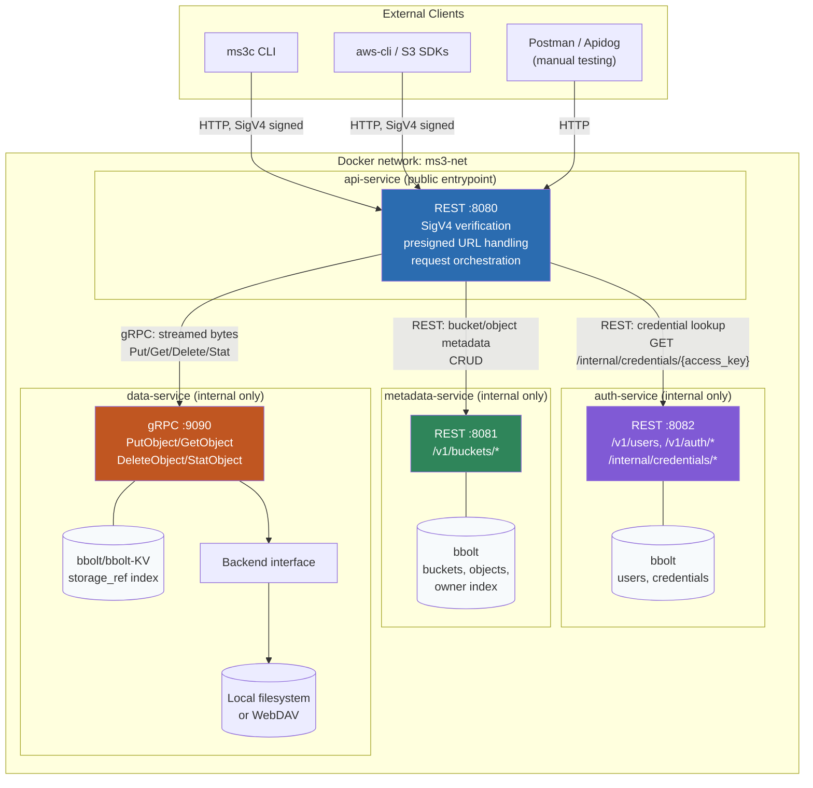

# ms3 — Mini Simple Storage Service

A lightweight, S3-compatible object storage server written in Go. Think MinIO, minus the operational weight — single
binary, single container, pluggable storage backends, and a CLI client for everyday use.

## Features

- S3-compatible REST API (buckets, objects, listing)
- CLI client (`ms3`) for managing buckets and objects from the terminal
- Pluggable storage backends — local filesystem or WebDAV
- Store any file/MIME type
- Presigned URLs with automatic expiration for secure, temporary downloads
- Dockerized — runs as a single container with `docker compose`

## Architecture

## License

[MIT](./LICENCE)
