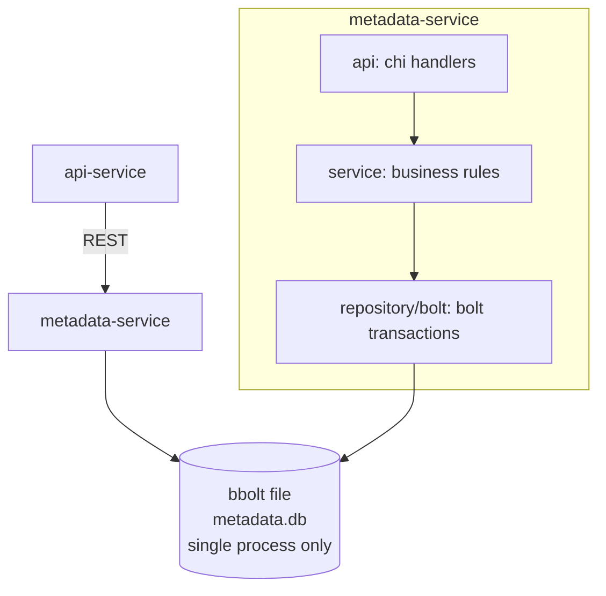
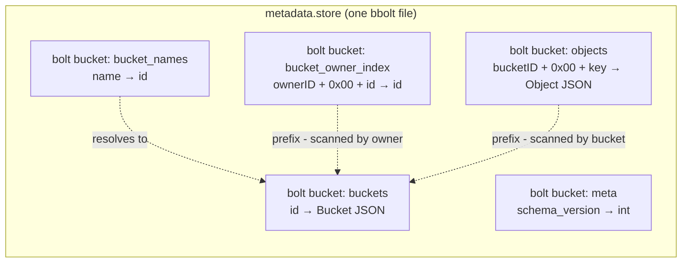
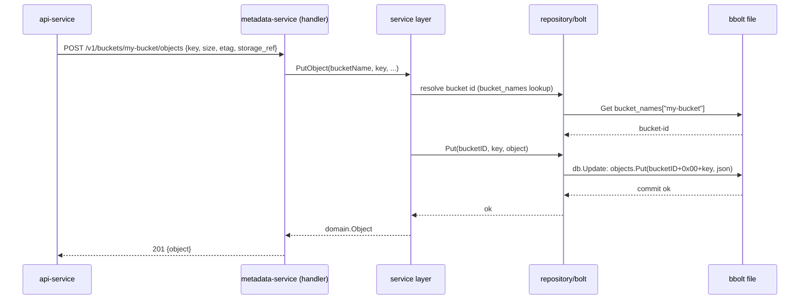

# metadata-service — Design Document (bbolt / embedded KV edition)

This supersedes the SQLite-based design. Same responsibilities, same HTTP API — the metadata store underneath is now [
`bbolt`](https://github.com/etcd-io/bbolt), a pure-Go embedded key-value store (the same engine that powers etcd, which
sits under every Kubernetes cluster you've been running on minikube). This is a real architectural shift, not just a
driver swap, so this doc spends real space on what changes and what to expect.

---

## 1. Architecture (unchanged shape, different store)



`metadata-service` is still the only thing that ever opens `metadata.db` — that's now a **hard requirement**, not just a
recommendation (see §3).

---

## 2. Terminology collision — read this first

bbolt itself uses the word **"bucket"** for its own internal namespaces (a bolt database is a tree of named byte-sorted
key→value stores, each called a "bucket"). That collides directly with our domain concept of an **S3 bucket**.
Throughout this doc and in code comments:

- **"bolt bucket"** = bbolt's internal namespace concept
- **"S3 bucket"** / plain **"bucket"** = the domain object (what a client creates with `PUT /{bucket}`)

Name your Go identifiers accordingly (`domain.Bucket` for the S3 concept, `boltBucketBuckets`/`boltBucketObjects` etc.
for the namespaces) so this doesn't become a recurring source of confusion when you're six files deep.

---

## 3. Why bbolt — trade-offs and what to expect

### What you gain

- **Prefix listing is native, not bolted on.** bbolt keys are stored sorted lexicographically, and
  `Cursor.Seek(prefix)` + iterate-while-prefix-matches is O(log n) to start and O(k) to scan k results. This is actually
  a *better* fit for S3's `ListObjectsV2?prefix=...` semantics than SQL's `LIKE 'prefix%'`, which needs a
  specifically-tuned index to avoid a table scan. You were fighting SQL to get something bbolt gives you for free.
- **True ACID transactions across everything in one file**, including your hand-rolled secondary indexes (§5). A
  `db.Update(func(tx *bolt.Tx) error {...})` can touch multiple bolt buckets atomically — write the bucket record, the
  name index, and the owner index in one all-or-nothing commit, with **zero risk of two concurrent bucket creates both
  slipping past a uniqueness check** (the whole transaction holds the writer lock, not just one statement).
- **Zero query planner surprises.** Every access pattern is something you wrote by hand and can reason about directly —
  there's no SQL query that silently stops using an index after a schema change.
- **Built-in hot backup.** `db.View(func(tx *bolt.Tx) error { return tx.WriteTo(w) })` streams a fully consistent
  snapshot of the live database to any `io.Writer` without stopping the server — genuinely convenient, and safer than
  copying a SQLite file mid-write without extra care.
- Deployment gets even lighter: one file, zero drivers beyond the pure-Go bbolt package, no cgo, no SQL dialect to think
  about.

### What you give up — and need to plan around

- **No ad-hoc queries.** There's no `sqlite3 metadata.db "SELECT * FROM buckets"` equivalent. Debugging means either
  writing a small Go snippet or using the `bbolt` CLI (§7) to poke at raw keys/values. Budget for this — it's the single
  biggest day-to-day convenience loss.
- **No referential integrity, at all.** SQLite at least enforced foreign keys within the file. bbolt enforces
  nothing — "an object's bucket_id must reference a real bucket" and "can't delete a non-empty bucket" are now 100% your
  service layer's responsibility, always executed inside one transaction to stay safe.
- **Secondary indexes are hand-rolled and hand-maintained.** Every access pattern beyond "get by primary key" (
  list-by-owner, prefix-list, count) needs its own explicitly-maintained bolt bucket that you keep in sync on every
  write. This is the real cost center of the KV approach — see §5 for the concrete design.
- **Single-process, single-writer, exclusively.** This is stricter than SQLite: bbolt takes an OS file lock and only one
  process may have the file open *at all* (not even for reads) at a time. This makes "run two `metadata-service`
  replicas behind a load balancer" **impossible** without adding a network layer in front of the store — previously this
  was a soft SQLite limitation you could work around later by swapping to Postgres; with bbolt it's a hard constraint
  baked into the storage engine itself. If you outgrow single-instance, the graduation path is swapping
  `internal/repository/bolt` for a client-server store (Postgres, etcd itself, FoundationDB) behind the same
  `repository.BucketRepository`/`ObjectRepository` interfaces — the interfaces don't change, only the implementation.
- **"Migrations" are Go functions, not SQL files.** No schema means no `ALTER TABLE`. Changing a value's shape means
  either (a) tolerant decoding (new field missing on old records → default it) or (b) a one-off Go function that walks
  every key in a bolt bucket, re-encodes, writes back, inside one transaction. §8 sets up the versioning hook for this
  now, before you need it.
- **File growth from copy-on-write.** bbolt's B+tree is copy-on-write, so deleted/updated pages aren't reclaimed
  immediately — the file can grow larger than your live data over time. Not a concern at this project's scale, but know
  `bbolt compact` exists if it ever matters.

---

## 4. Keyspace Design

Five bolt buckets (namespaces) inside the single `metadata.db` file:



### Key formats

| Bolt bucket          | Key                                     | Value                        | Purpose                                                                                                                                               |
|----------------------|-----------------------------------------|------------------------------|-------------------------------------------------------------------------------------------------------------------------------------------------------|
| `buckets`            | `<bucket-id>` (UUID)                    | JSON-encoded `domain.Bucket` | Primary record, keyed by immutable ID                                                                                                                 |
| `bucket_names`       | `<bucket-name>` (raw string)            | `<bucket-id>`                | Name → ID lookup **and** the uniqueness constraint — a `Get` before insert is your "is this name taken" check                                         |
| `bucket_owner_index` | `<owner-id>` + `0x00` + `<bucket-id>`   | `<bucket-id>`                | Secondary index: prefix-seek on `<owner-id>0x00` returns every bucket that owner has, in ID order                                                     |
| `objects`            | `<bucket-id>` + `0x00` + `<object-key>` | JSON-encoded `domain.Object` | Primary record, and the key format doubles as the listing index — prefix-seek on `<bucket-id>0x00<user-prefix>` is exactly `ListObjectsV2?prefix=...` |
| `meta`               | `schema_version`                        | integer (as bytes)           | Schema version marker for the migration hook (§8)                                                                                                     |

**Why `0x00` as the separator, not `/`:** object keys are user-supplied and routinely contain `/` (
`photos/2024/img.png`), so using `/` as our own internal delimiter would risk ambiguity if a bucket ID ever looked like
a key fragment. `0x00` never appears in a UUID and is trivial to reject if it ever shows up in a client-supplied object
key (return 400 — S3 doesn't allow embedded nulls in keys either).

**Why store the bucket ID as the value in `bucket_owner_index`/`bucket_names` even though it's derivable from context:**
avoids re-parsing byte slices on every read; a few extra bytes per index entry is a good trade for simpler, more
obviously-correct code.

### Soft delete, unchanged from the SQLite design

`domain.Object` keeps its `DeletedAt *time.Time` field. A delete overwrites the value in place with `DeletedAt` set
rather than removing the key — `Get`/`List` filter it out, and it stays consistent with the earlier design's
reconciliation story (`data-service` treats "no longer referenced by metadata-service" as the delete signal for its own
GC, regardless of soft- vs hard-delete underneath). If you'd rather simplify: hard-deleting the key outright is a
legitimate simplification here — call it out in an ADR if you make that call, since it's a real behavior change from the
original doc.

---

## 5. Transactions & Consistency

Every write that touches more than one bolt bucket happens inside a single `db.Update(func(tx *bolt.Tx) error {...})`
call. A few worked examples, since this is where the KV rewrite actually changes behavior (for the better) versus the
SQL version:

**Create bucket** — one transaction:

1. `bucket_names.Get(name)` — if found, return `ErrAlreadyExists` (transaction aborts, nothing written)
2. `buckets.Put(id, json(bucket))`
3. `bucket_names.Put(name, id)`
4. `bucket_owner_index.Put(ownerID+0x00+id, id)`

Because steps 1–4 run inside one exclusive transaction, there is **no window** where two concurrent creates for the same
name could both pass the existence check — bbolt simply blocks the second writer until the first transaction commits or
rolls back. This is a strictly stronger guarantee than the SQL version got implicitly from a `UNIQUE` constraint (same
outcome, more visible mechanism).

**Delete bucket** — one transaction:

1. Resolve `id := bucket_names.Get(name)`; not found → `ErrNotFound`
2. `Cursor.Seek(id+0x00)` on `objects`; if the first matching key has `DeletedAt == nil`, abort and return
   `ErrBucketNotEmpty` — no need to count everything, just check for one live object and stop
3. Delete from `buckets`, `bucket_names`, `bucket_owner_index`

Same win as before: the "is it empty" check and the actual delete happen in one atomic transaction, so there's no race
where a client uploads an object in the gap between the check and the delete — a race the original SQL design explicitly
flagged as needing extra care, which the KV rewrite closes for free.

**Put object metadata** — one transaction, and notably *simpler* than the SQL version: just
`objects.Put(bucketID+0x00+key, json(object))`. No `ON CONFLICT DO UPDATE` needed — overwriting a key in a KV store is
the natural operation, so upsert semantics fall out automatically.

---

## 6. Sequence: End-to-End Upload (through metadata-service's view)



---

## 7. Tooling & Install Commands

Same framework choices as before, with `bbolt` replacing the SQLite driver, plus its inspection CLI added:

```bash
# module setup (if starting fresh)
go mod init github.com/yousef-genedy/ms3/services/metadata-service

# HTTP router
go get github.com/go-chi/chi/v5

# embedded KV store
go get go.etcd.io/bbolt

# config
go get github.com/spf13/viper

# IDs
go get github.com/google/uuid

# request validation
go get github.com/go-playground/validator/v10

# test assertions
go get github.com/stretchr/testify

# tidy up go.mod/go.sum after adding everything
go mod tidy
```

`log/slog` needs no install — it's part of the standard library since Go 1.21.

Standalone tools (not Go modules your code imports, but worth having on your machine):

```bash
# linter, run in CI and locally
go install github.com/golangci/golangci-lint/cmd/golangci-lint@latest

# bbolt CLI — your replacement for "sqlite3 file.store" ad-hoc inspection
go install go.etcd.io/bbolt/cmd/bbolt@latest

# example usage once you have data:
bbolt buckets metadata.store                  # list bolt buckets
bbolt keys metadata.store bucket_names        # list keys in one bolt bucket
bbolt get metadata.store buckets <bucket-id>  # dump one value
```

---

## 8. Schema Versioning Hook

Set this up now, before you need it — cheap insurance against a painful first migration:

- On `Open()`, read `meta["schema_version"]`. If the bolt bucket structure doesn't exist yet (fresh file), initialize
  all five bolt buckets and write `schema_version = 1`.
- If `schema_version` is behind the version your code expects, run migration functions in order (`migrateV1toV2(tx)`,
  etc.) inside a single transaction, each walking the affected bolt bucket's keys, decoding the old JSON shape,
  re-encoding the new one, and writing back.
- If `schema_version` is *ahead* of what your code expects (an old binary opening a newer file), refuse to start rather
  than silently misinterpreting data — the equivalent of a SQL migration tool's "version mismatch" guard.

This is the direct analog of `internal/db/migrations/*.sql` from the SQLite design, just implemented as versioned Go
functions instead of SQL scripts.

---

## 9. Project Layout (rewritten)

```
metadata-service/
├── go.mod
├── go.sum
├── Makefile
├── README.md
├── .gitignore
├── .golangci.yml
├── config.example.yaml
├── Dockerfile
├── docs/
│   ├── design.md
│   ├── openapi.yaml
│   └── decisions/
│       ├── 0001-split-metadata-from-data-service.md
│       ├── 0002-soft-delete-for-objects.md
│       └── 0003-bbolt-over-sqlite-for-metadata-store.md
├── cmd/
│   └── server/
│       └── main.go
└── internal/
    ├── config/
    │   └── config.go
    ├── store/                        # was internal/db — bbolt lifecycle, not SQL
    │   ├── store.go                  # Open/Close, bolt-bucket bootstrap
    │   ├── migrate.go                # schema_version check + versioned upgrade funcs
    │   └── store_test.go
    ├── domain/
    │   ├── bucket.go
    │   └── object.go
    ├── repository/
    │   ├── repository.go             # unchanged interfaces — this is the point
    │   └── bolt/                     # was sqlite/
    │       ├── keys.go               # NEW — key-encoding/decoding helpers, shared across repos
    │       ├── bucket_repository.go
    │       ├── bucket_repository_test.go
    │       ├── object_repository.go
    │       └── object_repository_test.go
    ├── service/
    │   ├── bucket_service.go
    │   ├── object_service.go
    │   └── errors.go
    └── api/
        ├── router.go
        ├── handlers.go
        ├── dto.go
        └── errors.go
```

**What's genuinely new here versus the SQLite layout:** `internal/repository/bolt/keys.go` — a dedicated file for
encoding/decoding composite keys (`encodeObjectKey(bucketID, key string) []byte`,
`ownerIndexKey(ownerID, bucketID string) []byte`, etc.) and their inverses where needed. In the SQL version this logic
didn't exist at all — the query planner did it. In the KV version it's real code you own, so it earns its own file
rather than being scattered inline across the repository methods.

**Note on `docs/decisions/0003-*.md`:** write this ADR — it's the most consequential decision in this doc (bbolt vs
SQLite) and the one most likely to get second-guessed by a future reader (including future-you). Capture the reasoning
from §3 concisely: what you gained, what you gave up, and the single-instance constraint you're accepting deliberately.

---

## 10. What Else Changes Downstream — Don't Miss These

- **`data-service`'s own KV choice** (from the earlier design doc) can now literally be the same `bbolt` package instead
  of "SQLite used as a KV store" — you're already pulling in the dependency, and bbolt is a better semantic fit for that
  service's needs than the original suggestion. Worth updating that doc too when you get there.
- **Testing changes shape slightly**: repository tests now open `bbolt.Open` against a temp file (`t.TempDir()` +
  `filepath.Join(dir, "test.db")`) instead of SQLite's `:memory:` DSN — bbolt has no in-memory mode, but a tmpfs-backed
  temp dir is just as fast in CI and gets cleaned up automatically by `t.TempDir()`.
- **Backups**: if you ever wire up a `/admin/backup` endpoint or a cron job, bbolt's `tx.WriteTo(w)` (§3) is the
  mechanism — no need for the file-copy-with-caution dance SQLite backups sometimes need.
- **Bucket "list all objects across the whole file" style admin/debug queries** (which SQL made trivial with
  `SELECT * FROM objects`) now require a full bolt-bucket iteration — fine for occasional ops use via the `bbolt` CLI,
  but don't build a hot-path feature around it.

---

## 11. Suggested Build Order (updated)

1. `internal/store` — `Open`, bolt-bucket bootstrap, schema version check. Get this solid and unit-tested first;
   everything else depends on it.
2. `internal/repository/bolt/keys.go` — key encoding/decoding, tested in isolation with plain byte-slice assertions
   before any bbolt code touches them.
3. `internal/repository/bolt` — bucket and object repositories, implementing the *same* interfaces from the original
   design. If you kept `internal/service` and `internal/api` from before, they don't need to change at all — that's the
   payoff of having designed against interfaces from the start.
4. Re-run your existing service-layer and handler tests against the new repository implementation — they should pass
   unmodified, which is your confirmation that the swap was clean.